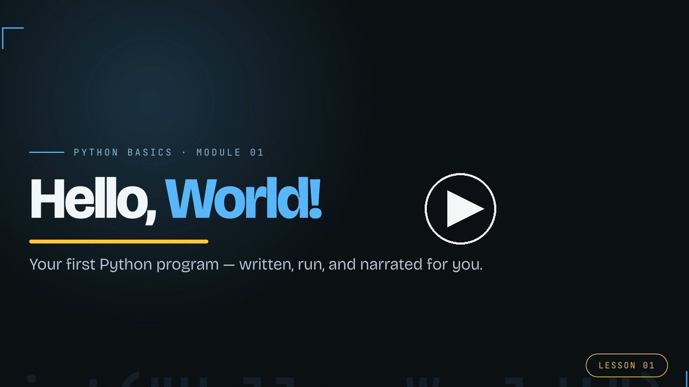

# Example: Hello, World! (explainer)

A ~32-second **explainer** video built end-to-end by the [`code-demo-video`](../../skills/code-demo-video/)
skill — no screen recording. A simulated VS Code window types out a Python `hello.py`,
opens the integrated terminal, runs it, and shows the output, with TTS voiceover and
word-synced captions. It's the canonical example that ships with the skill.

<a href="https://youtu.be/WsDKeWgSBDU"></a>

- **Video:** [`python-basics-hello-world.mp4`](python-basics-hello-world.mp4) (1920×1080, ~32s, H.264)
- **Source spec:** [`demo.spec.mjs`](demo.spec.mjs) — the single file that produced it
- **YouTube:** https://youtu.be/WsDKeWgSBDU

## How it was built

From a clean clone, this is the exact sequence (see the repo [README](../../README.md) for details):

```bash
SKILL="$PWD/skills/code-demo-video"
npx hyperframes init demo --example blank --non-interactive
cd demo
cp "$SKILL/assets/template.html.src" "$SKILL/assets/build-demo.mjs" .
mkdir -p fonts audio renders
cp "$SKILL/assets/fonts/BricolageGrotesque-Variable.woff2" fonts/
cp "$SKILL/assets/example-explainer.spec.mjs" demo.spec.mjs

# One TTS clip per beat (title, typing, run, outro), default Kokoro af_heart @ 0.95:
npx hyperframes tts "Let's write your first pie-thawn program — and watch this video build itself." --voice af_heart --speed 0.95 -o audio/vo-01-title.wav
npx hyperframes tts "Here in V S Code, we create a file called hello dot P Y, and type a single line: print, hello world." --voice af_heart --speed 0.95 -o audio/vo-02-typing.wav
npx hyperframes tts "Now we open the integrated terminal, and run it: pie-thawn hello dot P Y. And there's our output. Hello, World. Your first program." --voice af_heart --speed 0.95 -o audio/vo-03-run.wav
npx hyperframes tts "No screen recording, no editing. The code, the typing, even this voice — generated from one script." --voice af_heart --speed 0.95 -o audio/vo-04-outro.wav

# Captions: transcribe each clip, rename the transcript to match
for clip in vo-01-title vo-02-typing vo-03-run vo-04-outro; do
  npx hyperframes transcribe "audio/$clip.wav" --model small.en
  mv audio/transcript.json "audio/$clip.json"
done

node build-demo.mjs                 # → index.html (0 warnings)
npx hyperframes lint                # 0 errors
npx hyperframes validate            # no console errors · 178 elements pass WCAG AA
npx hyperframes render --output renders/python-basics-hello-world.mp4 --quality standard
```

Total build time after assets are in place: well under two minutes on a laptop.
The `pie thawn` / `P Y` TTS respellings are mapped back to "Python" / "py" in the captions
via the spec's `captionFixes`.
